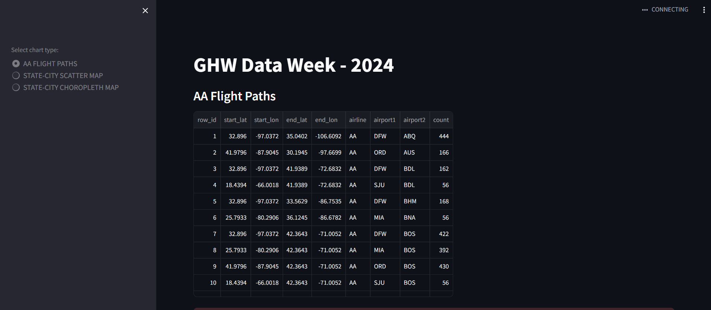

# MLH GHW Data week: Interactive Maps Visualization

## Demo: Current Status



## Todo

1. Fix the maps component below the table.

## Tutorial

Part 1: https://www.youtube.com/watch?v=s6WuhLG2gA8

Part 2: https://www.youtube.com/watch?v=fDKkmuZfxZc

## Replit

https://replit.com/@UtkarshTiwari33/GHWDataWeek2024#main.py

## Install Dependencies

```bash
pip install -r requirements.txt
```

*On Linux, if you encounter error messages regarding pycairo, try this:*

```bash
sudo apt install libcairo2-dev pkg-config python3-dev
```

## Build & Run

```bash
streamlit run main.py
```
